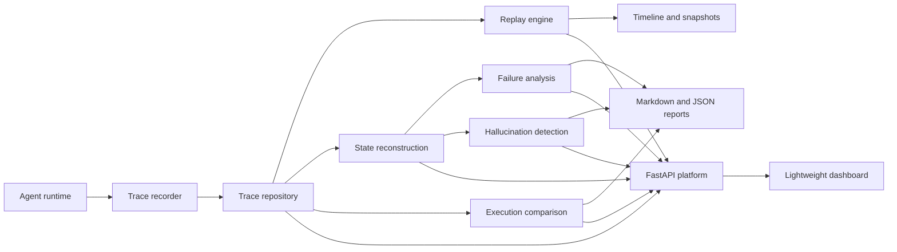

# Hallucination Replay System

**A deterministic debugging platform for AI agent failures.**

`hallucination-replay-system` helps engineers load agent traces, replay execution timelines, reconstruct state, analyze failures, detect hallucinations against available evidence, compare executions, and generate reproducible reports through Python APIs, FastAPI endpoints, and lightweight dashboard helpers.

> Status: v1.0.0rc1 release-candidate prep. No v1.0.0 tag or GitHub release has been created yet.

## Why this exists

AI agents need debuggers, not just logs. When an agent fails, evidence is usually scattered across prompts, model outputs, retrieval logs, memory events, tool calls, validation checks, and application code. That makes root-cause analysis slow, anecdotal, and hard to reproduce.

This project turns captured traces into deterministic debugging artifacts so teams can answer:

- What did the agent know at the failing step?
- Was the answer supported by retrieval, memory, or tool evidence?
- Did a tool fail, timeout, return malformed data, or get misread?
- Was memory stale, missing, overwritten, or contradictory?
- Did validation miss a failure?
- What changed between a successful run and a failed run?

## Capability matrix

| Area | Capability | Status |
| --- | --- | --- |
| Trace models | Typed run, step, metadata, memory, retrieval, reasoning, validation, tool call, and tool result schemas | Ready |
| Storage | Filesystem repository, JSON store, index, search, filters, retention, import/export, compression | Ready |
| Replay | Deterministic loader, controller, timeline, navigation, snapshots, checkpoints, CLI | Ready |
| Reconstruction | Context, conversation, prompt, memory, retrieval, tools, validation, reasoning summaries, full state | Ready |
| Failure analysis | Intent, retrieval, memory, tool, validation, reasoning, output findings, confidence, root causes, reports | Ready |
| Hallucination detection | Claim extraction, evidence matching, unsupported claims, contradictions, scoring, severity, benchmarks | Ready |
| Comparison | Trace, state, context, retrieval, memory, tool, reasoning, timeline diffs and aggregate reports | Ready |
| Platform API | FastAPI health, version, traces, replay, reconstruction, analysis, hallucination, comparison endpoints | Ready |
| Dashboard | Lightweight deterministic HTML helpers for timeline, replay, failure, and hallucination views | Ready |
| Release quality | Coverage gate, CI, release workflow, docs, benchmarks, validation script | In progress |

## Architecture overview



See [docs/architecture.md](docs/architecture.md) and [docs/assets/architecture.mmd](docs/assets/architecture.mmd) for the architecture guide and source diagram.

## Quickstart

Python 3.11 or newer is required.

```bash
git clone https://github.com/aditya89bh/hallucination-replay-system.git
cd hallucination-replay-system
python3.11 -m venv .venv
source .venv/bin/activate
python -m pip install --upgrade pip
python -m pip install -e ".[dev]"
```

Run the quality gate:

```bash
pytest
ruff check .
mypy .
```

Generate coverage:

```bash
pytest --cov
```

## Demo workflow

Use the included benchmark and example traces to explore the system.

Run hallucination evaluation fixtures:

```bash
pytest tests/test_hallucination_evaluation.py tests/test_hallucination_integration.py
```

Run replay and storage benchmarks:

```bash
python benchmarks/storage_benchmark.py
python benchmarks/replay_benchmark.py
```

Run comparison benchmarks:

```bash
python benchmarks/comparison/comparison_benchmark.py
cat benchmarks/comparison/summary.json
```

Start the FastAPI platform with an ASGI server such as `uvicorn`:

```bash
uvicorn hallucination_replay.api:create_app --factory --reload
```

Upload a trace and run hallucination analysis:

```bash
curl -X POST http://localhost:8000/traces \
  -H 'content-type: application/json' \
  --data @benchmarks/hallucination/contradiction.json

curl -X POST http://localhost:8000/hallucination/run \
  -H 'content-type: application/json' \
  -d '{"run_id":"hallucination-contradiction","step_index":3,"report_id":"demo"}'
```

See [docs/demo_guide.md](docs/demo_guide.md) for a complete walkthrough.

## Benchmark summary

Benchmarks are intentionally lightweight and local-first:

- `benchmarks/storage_benchmark.py` measures filesystem repository save, load, list, and search timing.
- `benchmarks/replay_benchmark.py` measures replay controller loading, navigation, snapshots, and timeline export.
- `benchmarks/hallucination/*.json` provide deterministic unsupported-claim, contradiction, partial-support, and full-support fixtures.
- `benchmarks/comparison/comparison_benchmark.py` generates deterministic comparison work-unit metrics.

See [docs/benchmarks.md](docs/benchmarks.md) for commands and interpretation guidance.

## Documentation

- [Architecture](docs/architecture.md)
- [API reference](docs/api_reference.md)
- [OpenAPI usage](docs/openapi.md)
- [CLI reference](docs/cli_reference.md)
- [Benchmark guide](docs/benchmarks.md)
- [Demo guide](docs/demo_guide.md)
- [Trace schema](docs/trace_schema.md)
- [Production readiness](docs/production_readiness.md)
- [Development guide](docs/development.md)
- [Contributing guide](CONTRIBUTING.md)
- [Changelog](CHANGELOG.md)

## Production readiness note

The project is suitable for local, CI, and trusted internal debugging workflows over sanitized traces. It is not yet a hosted multi-tenant observability service. Authentication, authorization, database-backed report storage, distributed ingestion, and a rich browser UI are intentionally outside the current core release scope.

Before using real production traces, redact secrets, customer data, private prompts, and sensitive tool outputs. The deterministic analysis engine does not call external LLMs.

See [docs/production_readiness.md](docs/production_readiness.md) for operational guidance and known gaps.

## Roadmap

### v1.0.0 release candidate

- Release-candidate metadata is set to `1.0.0rc1`.
- Release documentation, repository presentation, release workflow, and validation script are in place.
- Final release-candidate checks should confirm coverage, lint, typing, tests, build, and repository validation pass.
- Do not publish or tag until explicitly approved.

### Future work

- Hosted ingestion and durable report storage.
- Authentication and authorization for deployed APIs.
- Rich browser dashboard and collaborative incident workflows.
- Additional repository backends.
- More benchmark suites and real-world sanitized trace examples.

## Development

Standard local gate:

```bash
pytest
ruff check .
mypy .
python -m build
```

Coverage gate:

```bash
pytest --cov
```

See [docs/development.md](docs/development.md) for setup, release checks, and commit discipline.
