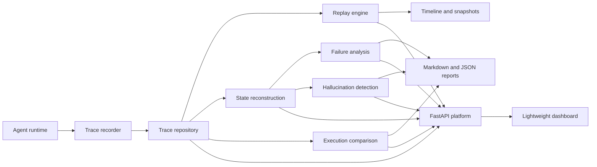

# Architecture

The hallucination replay system is designed as an observability and debugging package for AI agent executions. Phase 1 establishes the repository foundation only; the components below describe the intended production architecture for future phases.

## System Overview

The release-candidate architecture is centered on deterministic trace data.
Captured traces flow through storage, replay, reconstruction, failure analysis,
hallucination detection, comparison, API, and dashboard layers.

The source Mermaid diagram is also available at
[`docs/assets/architecture.mmd`](assets/architecture.mmd).

## Trace Recording

Trace recording captures the raw evidence needed to reproduce an agent run. A complete trace should include prompts, model responses, retrieval queries, retrieved documents, memory reads and writes, tool calls, tool results, validation events, timestamps, token usage, and runtime metadata.

The recorder should be append-only and deterministic where possible. It should avoid mutating agent behavior while preserving enough detail to replay decision points, inspect context windows, and compare expected versus observed outcomes.

## Replay Engine

The replay engine rehydrates a recorded trace into a controlled execution timeline. Its job is not to make new agent decisions during Phase 1 foundations, but future implementations should support deterministic step playback, breakpoint-style inspection, and optional substitution of mocked model, retrieval, memory, and tool responses.

Replay must clearly separate recorded facts from regenerated or simulated data so analysts can trust what was actually observed during the original run.

## State Reconstruction

State reconstruction rebuilds the agent-visible world at each trace step. This includes conversation state, memory state, retrieved context, intermediate reasoning artifacts when available, tool state, and validation outputs.

The reconstruction layer should make it possible to answer questions such as:

- What did the model know at this step?
- Which retrieved documents were present or absent?
- Was memory stale, missing, contradictory, or overwritten?
- Did a tool result differ from what the agent assumed?

## Failure Analysis

Failure analysis identifies plausible root causes across hallucination, retrieval, memory, tool, reasoning, and validation failure modes. The analysis layer should operate from reconstructed state and recorded events, producing evidence-backed findings rather than opaque labels.

Expected analysis categories include:

- Hallucination caused by unsupported generation
- Retrieval miss, ranking failure, or context truncation
- Memory omission, corruption, staleness, or conflict
- Tool invocation, schema, timeout, or result interpretation failure
- Reasoning inconsistency or invalid intermediate assumption
- Validation gap, false positive, or ignored validation failure

## Reporting

Reporting turns replay and analysis results into actionable debugging artifacts. Reports should include a timeline, key evidence, suspected root causes, confidence levels, remediation suggestions, and links back to trace events.

Future report targets may include Markdown, JSON, HTML, notebooks, or CI artifacts. Reports should be reproducible and suitable for sharing with engineering, evaluation, and product teams.
